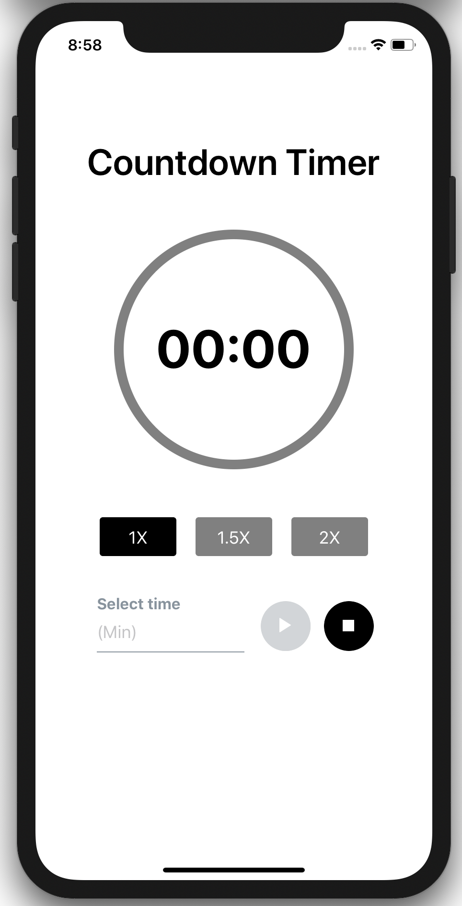
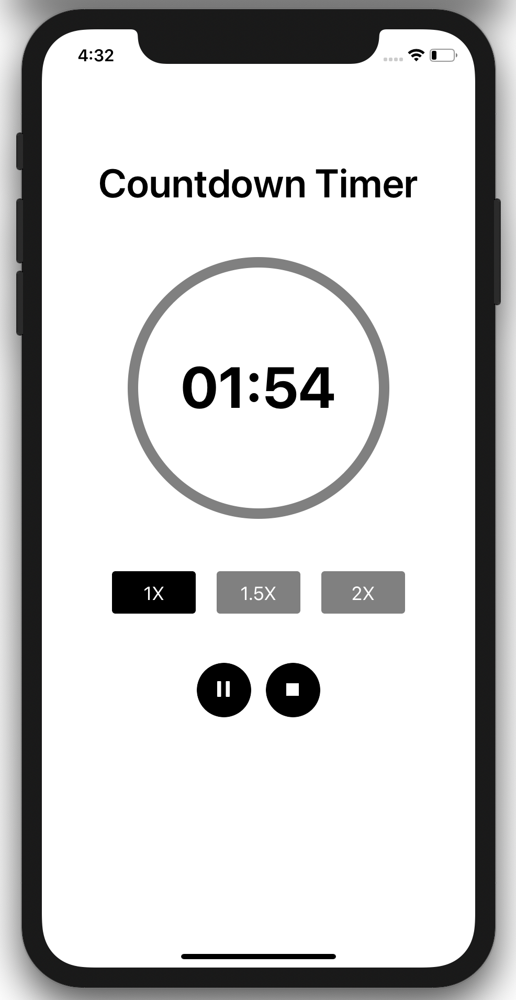
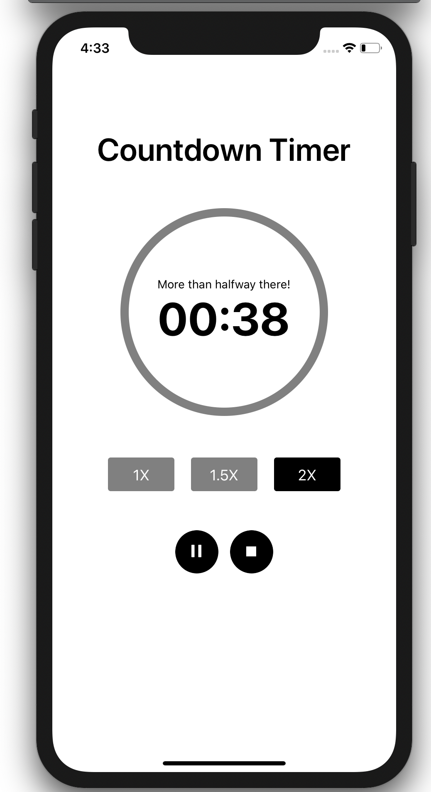
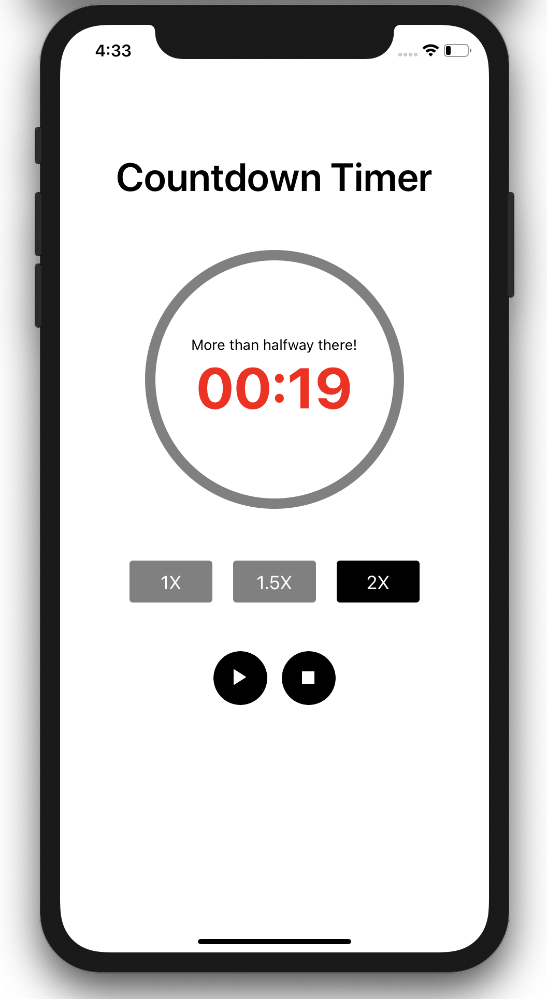

# Countdown Timer App

A Countdown Timer application using React Native

## Installation

```bash
$ yarn install
```

## iOS Installation

```bash
$ cd ios && pod install
```

## Running the app

```bash
# iOS devices
$ yarn ios

# Android devices
$ yarn android
```

## Test

```bash
# unit tests
$ yarn test
```

## Example

</img>
</img>
</img>
</img>


## Stay in touch

- Author - [Daniel Mejia](https://github.com/danielmejiadev)

## License

This project is licensed under the [MIT licensed](LICENSE) - see the LICENSE file for details.